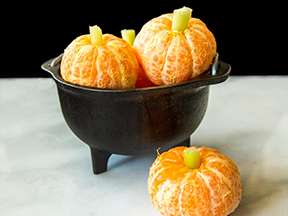
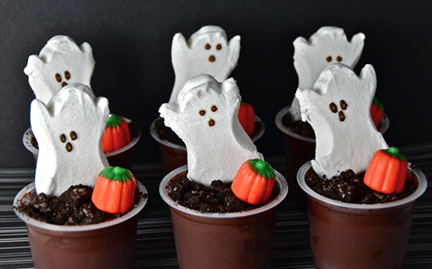
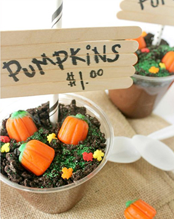
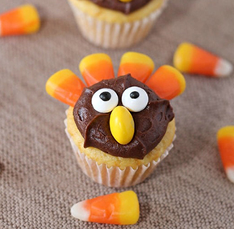
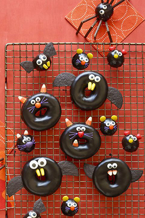
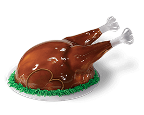

A large part of planning a great class party is the food!

<!-- end -->

Unfortunately, due to differing school policy as well as allergy precautions, [Room Party Parent] (https://roompartyparent.com) is unable to provide snacks or treats as part of our party boxes. We can, however, offer a few ideas that look cute, are themed for your party, and are simple to recreate. While presenting these, I’m keeping my kids’ school rules in mind. We don’t have to do individually wrapped, but our items must be store bought, in a sealed package, and have the ingredients listed on the outside. Our options are limited to be sure, but we can still have fun!

First up, who hasn’t seen the ol’ **peeled orange/clementine/mandarin masquerading as a pumpkin** trick? It’s popular because it works! It’s adorable, can be used for both Fall and Halloween, AND it’s somewhat healthy. I say somewhat because in my version I use green licorice for the stem instead of celery. My kids are great veggie eaters, but not when it comes to celery! I can find green licorice at my local grocery store, but Amazon has options too. It’s typically a green apple flavor. These treats can also be accommodating for a lot of allergies.

Another great option is **trail mix**. Get a variety of items beforehand (avoiding any known allergies your classroom has), lay them out, give the kids a bag, and have them mix and match according to their tastes. They can then tie up the bag and take home whatever they don’t finish at the party. Great trail mix add ins include popcorn, pretzels, M&Ms (in themed colors for your party!), marshmallows (I saw candy corn shaped & flavored marshmallows the other day!), candy corn, cereal, candy pumpkins, nuts, dried fruit, … the list is virtually endless! Have the baggie be a latex free glove and fill it up as a turkey for Fall or a creepy hand for Halloween.

An idea I’ve used a couple of times is a **themed pudding cup**. That would be “Ghost in the graveyard” for Halloween and “Pumpkin Patch” or “Dirt and Worms” for either Fall or Halloween themes. The “dirt” is crumbled oreos, which you can purchase already crumbled in a box in your grocery store baking aisle. You don’t have to spend time crumbling them up at the party! Side note - I once saw a mom take a hammer to a package of oreos at a party. Yeah, it got the job done, but the pre crumbled ones still have my vote! This is another good option if you’re avoiding nuts. You can also avoid gluten by not sprinkling the oreo topping.
Speaking of oreos... Those little fellas are delicious as well as versatile. Glutino is a brand to try for a gluten free option - they even have double stuffed!! You could do an oreo/trail mix bar where you have ingredients for a build your own spider or turkey treat. In my experience, kids have a lot of fun when they get a little hands on with their snack. As long as it doesn’t take too long - we’ve got to get to those games!

Another possibility in this same vein is to purchase **prepackaged cupcakes and have the kids do some decorating**. Here are cute turkey and owl versions.
One year, a student’s dad came in and whipped these up. They were really easy and looked awesome!

Here’s another idea you could do using chocolate iced donuts.

One more idea that I may look into this year - a themed **ice cream cake from Baskin Robbins**. It costs more than the other options here, but can you imagine this ice cream turkey in person?? Your class’s own little turkey feast! (This is not a paid endorsement for Baskin Robbins. It was just something I saw and was delighted by!) They also have monsters and pumpkins for Halloween.

Also, if you want to get REALLY simple with your treats, I have to say that my own kids have never been happier than when someone has brought in **Little Debbie Cosmic Brownies**.
And, that’s my list of top and simple treats for your next Fall or Halloween party! There’s a million wonderful ideas out there, so I wanted to bring focus to some good, easy options. Since schools are getting more restrictive in what can be brought in, I highlighted treats that can be put together in the classroom in a very short amount of time. That leads right into my...

### Classroom Party Tip #2:

**Keep It Simple**. Ask me if I followed this tip my first time as lead room mom. The answer is: Heck No! My first party was an exercise in overcomplication. I set out to be the GOAT of room moms and did not come anywhere near success. I had a complicated scavenger hunt with rhyming word clues (for 2nd graders whose reading skills are all over the place), a craft that involved sewing a spider web (did I think the party was going to be 3 hrs???), health conscious snacks that went over like a lead balloon, and games we didn’t even get to because we ran out of time. I rushed everyone throughout the party trying to get to everything (I wasn’t about to let my boxes of supplies go to waste!) and because of that, I don’t think anyone had a good time. I still get a little ashamed when I think about that first party. I learned my lesson though. When we’re talking about an hour long school party for 20+ kids, simplicity is key!
